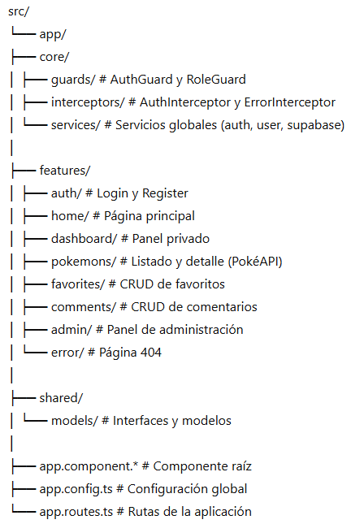

# 🧩 Pokedex Social

Aplicación web desarrollada con Angular y Supabase que integra la API pública PokéAPI para consultar Pokémon, guardar favoritos y permitir comentarios con sistema de roles (user/admin).

---

## 🚀 Tecnologías utilizadas

- Angular (Standalone Components)
- TypeScript
- Supabase (Auth + PostgreSQL + RLS)
- PokéAPI (API pública)
- SCSS
- JWT Authentication
- HttpInterceptor

---

## 🔐 Autenticación

La aplicación utiliza autenticación mediante Supabase:

- Registro e inicio de sesión con email y contraseña
- JWT gestionado automáticamente
- Guards para protección de rutas
- Interceptor que añade el token a las peticiones
- Sistema de roles (user/admin)

---

## 👤 Roles

### Usuario normal
- Ver listado y detalle de Pokémon
- Añadir favoritos
- Añadir comentarios
- Editar y borrar sus propios comentarios

### Administrador
- Todo lo anterior
- Editar y eliminar favoritos globales
- Eliminar comentarios globales
- Gestionar roles de usuarios
- Panel de moderación de contenido

---

## 📦 Funcionalidades principales

### 🔎 Pokémons
- Listado paginado
- Buscador por nombre o ID
- Vista detalle con tipos y stats
- Integración con PokéAPI

### ⭐ Favoritos (CRUD)
- Crear favorito
- Ver favoritos propios
- Editar favorito (admin)
- Eliminar favorito (admin)
- Protección con RLS

### 💬 Comentarios (CRUD)
- Listado en detalle del Pokémon
- Crear comentario (autenticado)
- Editar y eliminar propio comentario
- Moderación admin

### 🛠 Panel Admin
- Gestión de usuarios (roles)
- Gestión global de favoritos y comentarios

---

## 🛡 Seguridad

- Row Level Security (RLS) en Supabase
- Policies diferenciadas por rol
- Función SQL `is_admin()`
- Guards en frontend
- Interceptor JWT

---

## 📁 Estructura del proyecto


---

## ⚙️ Instalación local

1. Clonar el repositorio:
```
git clone https://github.com/Annihilux/pokedex-social.git 
```

2. Instalar dependencias:
```
npm install 
```

3. Configurar Supabase en `environment.ts`

4. Ejecutar:
```
ng serve 
```

---

## 🌍 API pública utilizada

- https://pokeapi.co/

---

## 📌 Autor

Miguel Notario Díaz. \
Proyecto desarrollado para la asignatura DWES.